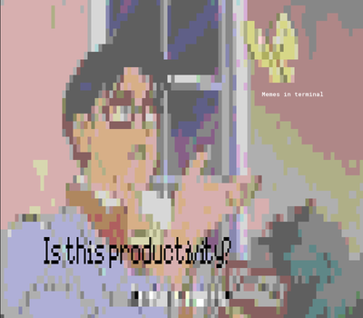
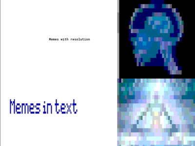
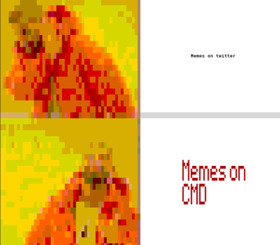
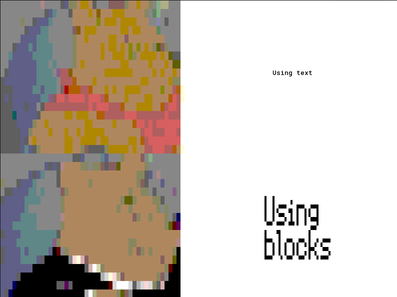

meme2txt
---

It's the utility you didn't you know you needed. Make memes right in your
terminal.

## Dependencies

In order to run, [img2txt.py](https://github.com/hit9/img2txt) is required. In
addition, [toilet](http://caca.zoy.org/wiki/toilet) is recommended for quality memes.

## Usage

```
Usage:
  meme2txt <img2txt arguments> [--meme text column row [color]]
```

* `<img2txt arguments>` will generally be `<image path> --targetAspect=xx`. See [img2txt](https://github.com/hit9/img2txt) for comprehensive list of commands.
* `--meme` renders text to the image.
  * `text` can be a multiline blob of text.
  * `column` the column number to start the text.
  * `row` the row number to start the text.
  * `color` one of (`black|red|blue|green|yellow|grey|white`). Defaults to black. To use the system default, use `-`.

## Examples

Note for copyright reasons, the source images have not been provided- however
I'm sure you can find even more robust memes out there.


```bash
meme2txt.sh ~/images/butterfly.jpg  --targetAspect=0.6 \
  --meme "Memes in terminal" 16 72 "-" \
  --meme "$(toilet "Is this productivity?" -fsmblock)" 35 12 black
```

---


```bash
meme2txt.sh ~/images/blown.jpg --targetAspect=0.5 \
  --meme "Memes with resolution" 10 25 black \
  --meme "$(toilet "Memes in text" -fsmblock)" 25 5 blue
```

---


```bash
meme2txt.sh ~/images/drake.jpg --targetAspect=0.5 \
  --meme 'Memes on twitter' 10 68 black \
  --meme "$(echo -e "Memes on\\n CMD" | toilet -fsmblock)" 28 65 red
```

---


```bash
meme2txt.sh $image --targetAspect=0.5 \
  --meme "Using text" 9 68 black \
  --meme "$(echo -e "Using\n blocks" | toilet -fsmblock)" 24 66
```
